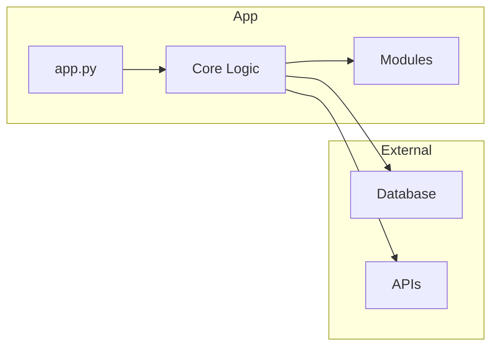

# [Nombre del Proyecto]

  

## Descripción

[Qué hace el proyecto en una frase]

## Arquitectura del Sistema



## Instalación

```bash
# Clona el repositorio
$ git clone https://github.com/usuario/[NombreDelProyecto].git
$ cd [NombreDelProyecto]

# Crea un entorno virtual
$ python -m venv venv
$ source venv/bin/activate  # Linux/Mac
$ venv\Scripts\activate   # Windows
$ .\venv\Scripts\Activate.ps1

# Actualiza pip, setuptools y wheel
$ python.exe -m pip install --upgrade pip setuptools wheel

# Instala dependencias
$ pip install -r requirements.txt
```

# Requisitos de Python
> **Importante:** este proyecto está probado con **Python 3.11–3.14** y requiere una
> versión de `streamlit` anterior (1.18.1) debido a compatibilidades con Python 3.14.
> No utiliza `langchain`, por lo que las dependencias son ligeras y fáciles de instalar.

> **Nota:** el archivo incluye `pytest` como dependencia de desarrollo para ejecutar pruebas locales; no es estrictamente necesario en producción.


## Configuración de Entorno

Crea un archivo `.env` en la raíz del proyecto con las variables necesarias:

```ini
# .env
SECRET_KEY=tu_secreto_aqui
DATABASE_URL=sqlite:///db.sqlite3
```

| Variable       | Descripción                        | Ejemplo                    |
|----------------|------------------------------------|----------------------------|
| `SECRET_KEY`   | Clave de seguridad para la app     | `s3cr3t`                   |
| `DATABASE_URL` | URL de conexión a la base de datos | `sqlite:///db.sqlite3`     |

## Ejemplos de Uso

Esta aplicación corre como **web app con Streamlit**, por lo que simplemente lanzas
el servidor y accedes desde tu navegador.

```bash
# después de activar el entorno y haber instalado requerimientos:
streamlit run app.py
```

Abre `http://localhost:8501` en el navegador; la interfaz te permitirá subir el
componente, especificar la API Key y elegir el modelo. Se mostrarán lado a lado el
código original y el resultado refactorizado.

También puedes importar y usar la función desde otro script:

```python
from app import refactor_code

texto = "..."  # contenido de tu componente
resultado = refactor_code(texto, api_key="sk-...", model_name="gpt-4o")
print(resultado)
```

## Estructura de Directorios

```
[NombreDelProyecto]/
├── app.py
├── requirements.txt
├── README.md
├── .env.example
└── tests/
    └── test_app.py
```

## Testing

Ejecuta las pruebas con:

```bash
$ pytest
```

## Contribución

¡Gracias por tu interés en contribuir! Por favor, abre un *issue* o un *pull request* con tu propuesta. Asegúrate de seguir el código de conducta del proyecto.

## Licencia

Este proyecto está bajo la licencia MIT. Consulta el archivo `LICENSE` para más detalles.
