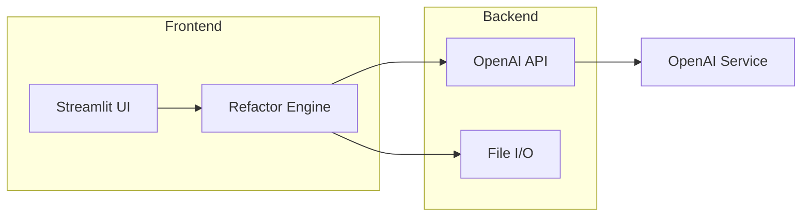

# [Nombre del Proyecto]

  

## Descripción

[Qué hace el proyecto en una frase]

## Arquitectura del Sistema



## Instalación

```bash
# Clona el repositorio
git clone https://github.com/usuario/[NombreDelProyecto].git
cd [NombreDelProyecto]

# Crea y activa un entorno virtual
python -m venv venv
# Linux/Mac
source venv/bin/activate
# Windows PowerShell
venv\Scripts\Activate.ps1

# Actualiza instaladores
disable-pip-version-check=false
python -m pip install --upgrade pip setuptools wheel

# Instala dependencias
git config --local core.autocrlf input
pip install -r requirements.txt
```

## Configuración de Entorno

Coloca un archivo `.env` en la raíz con estas variables:

```ini
# .env
OPENAI_API_KEY=sk-yourkey
OPENAI_MODEL=gpt-4o
```

| Variable        | Propósito                                 | Ejemplo                  |
|-----------------|-------------------------------------------|--------------------------|
| `OPENAI_API_KEY`| Clave para autenticar contra OpenAI       | `sk-...`                 |
| `OPENAI_MODEL`  | Modelo por defecto para las solicitudes   | `gpt-4o`                 |

## Ejemplos de Uso

### Uso como módulo

```python
from app import refactor_code

texto = "...código AS/400..."
resultado = refactor_code(texto, api_key="sk-...", model_name="gpt-4o")
print(resultado)
```

### Interfaz Web (Streamlit)

```
streamlit run app.py
# luego abre http://localhost:8501 en el navegador
```

Puedes subir un archivo y ver el original y la versión SFTP en pantalla.

## Estructura de Directorios

```
[NombreDelProyecto]/
├── app.py                # punto de entrada Streamlit + lógica
├── requirements.txt      # dependencias
├── README.md
├── .env.example          # ejemplo de configuración
└── tests/
    └── test_app.py       # pruebas unitarias
```

## Testing

```bash
pip install -r requirements.txt
pytest -q
```

## Contribución

1. Haz un *fork* del repositorio
2. Crea una rama (`feature/nueva-funcion`)
3. Añade código y documentación
4. Envía un *pull request*

Lee el `CONTRIBUTING.md` y el código de conducta antes de participar.

## Licencia

Proyecto bajo **MIT License**. Consulta `LICENSE` para detalles.
