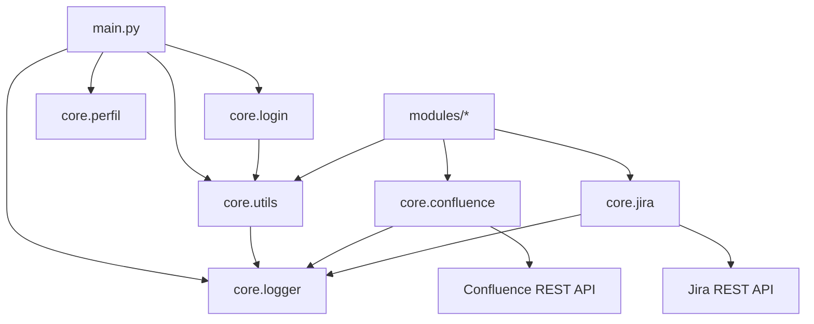

# Core: Componentes de Primer Nivel

## Alcance
Este documento describe unicamente los componentes ubicados directamente dentro de la carpeta core, sin considerar subcarpetas como core/domain, core/infrastructure o core/ui.

## Objetivo de la carpeta core
La carpeta core concentra capacidades transversales reutilizables por toda la aplicacion: autenticacion, autorizacion por perfil, utilidades comunes, integraciones HTTP empresariales y logging centralizado.

## Diagrama de Interaccion (Nivel Core)

## Componentes de core (sin subcarpetas)

### 1) __init__.py
- Rol: inicializador del paquete core.
- Estado actual: archivo vacio.
- Utilidad: permite importar modulos usando namespace core.* y mantiene compatibilidad de empaquetado Python.

### 2) logger.py
- Rol: capa de observabilidad y estandarizacion de logs.
- Responsabilidades:
  - configurar logging global una sola vez (`configure_logging`).
  - obtener loggers por nombre de modulo (`get_logger`).
  - registrar operaciones con formato uniforme (`log_operation`).
- Valor tecnico:
  - evita configuraciones duplicadas de handlers.
  - facilita trazabilidad de exito/fallo por operacion (incluyendo `error_code` y `details`).

### 3) utils.py
- Rol: utilidades transversales de autenticacion y soporte UI.
- Responsabilidades:
  - carga de usuarios desde entorno (`AUTH_USERS_JSON` o `AUTH_USER`/`AUTH_PASSWORD`).
  - validacion segura de credenciales con `hmac.compare_digest`.
  - carga cacheada de prompts de agentes (`load_agent_prompt`).
  - encabezado visual estandar para pasos de wizard (`step_header`).
- Valor tecnico:
  - centraliza logica comun para reducir duplicidad en modulos.
  - protege contra comparaciones inseguras de hashes de password.

### 4) login.py
- Rol: flujo de autenticacion de interfaz Streamlit.
- Responsabilidades:
  - inicializar estado de sesion de auth (`logged_in`, `username`, `login_error`).
  - mostrar formulario de login y validar credenciales via `core.utils.check_credentials`.
  - ocultar sidebar hasta que exista sesion autenticada.
  - cerrar sesion limpiando `st.session_state` completo.
- Valor tecnico:
  - encapsula acceso al sistema en un unico punto.
  - desacopla pantalla de login del resto del portal.

### 5) perfil.py
- Rol: control de autorizacion y administracion de perfiles por modulo.
- Responsabilidades:
  - definir catalogo de modulos habilitables (`MODULES`).
  - cargar perfiles y admins desde entorno (`USER_PROFILES_JSON`, `ADMINS_CSV`) con fallback seguro.
  - resolver permisos por usuario (`get_user_modules`, `has_module_access`, `is_admin`).
  - renderizar panel de administracion de perfiles para usuarios admin.
- Valor tecnico:
  - separa claramente autenticacion (quien eres) de autorizacion (que puedes usar).
  - soporta configuracion externa sin recompilar codigo.

### 6) confluence.py
- Rol: integracion con API REST de Confluence para publicacion y metadata.
- Responsabilidades:
  - construir headers de autenticacion Basic.
  - validar URL base y datos requeridos.
  - subir contenido Markdown como pagina (`upload_markdown_to_confluence`).
  - resolver metadata de pagina a partir de link (`get_confluence_page_metadata_from_link`).
  - aplicar reintentos con backoff para errores transitorios HTTP/URL.
  - registrar eventos operativos con `log_operation`.
- Valor tecnico:
  - estandariza salida documental del sistema hacia Confluence.
  - robustece comunicaciones en entornos de red empresarial.

### 7) jira.py
- Rol: integracion con API REST de Jira Cloud para creacion de issues.
- Responsabilidades:
  - construir autenticacion Basic para Jira.
  - convertir texto a ADF minimo (`jira_wiki_to_adf`).
  - validar entrada de negocio (URL, Project Key, Issue Type, Summary, credenciales).
  - crear issue remoto (`create_jira_issue`) con reintentos y manejo de errores.
  - registrar trazas de resultado via `log_operation`.
- Valor tecnico:
  - automatiza handoff de salidas funcionales a backlog ejecutable.
  - homologa el formato de descripcion para compatibilidad con Jira Cloud.

## Dependencias internas entre componentes

1. logger.py es consumido por:
- utils.py
- confluence.py
- jira.py

2. utils.py es consumido por:
- login.py (autenticacion)
- modulos funcionales (carga de prompts y encabezados por paso)

3. perfil.py es consumido por:
- main.py para visibilidad de tarjetas y guardas de acceso

4. confluence.py y jira.py son consumidos por:
- servicios de integracion y modulos de negocio que publican artefactos

## Variables de entorno relevantes en core

- Autenticacion:
  - `AUTH_USERS_JSON`
  - `AUTH_USER`
  - `AUTH_PASSWORD`

- Perfiles y admins:
  - `USER_PROFILES_JSON`
  - `ADMINS_CSV`

- Confluence:
  - `CONFLUENCE_BASE_URL`
  - `CONFLUENCE_SPACE_KEY`
  - `CONFLUENCE_USER`
  - `CONFLUENCE_API_TOKEN`

- Jira:
  - `JIRA_USER`
  - `JIRA_PASSWORD`

- HTTP y resiliencia:
  - `HTTP_TIMEOUT_SECONDS`
  - `HTTP_MAX_RETRIES`
  - `HTTP_BACKOFF_SECONDS`

- Logging:
  - `LOG_LEVEL`

## Fortalezas actuales
- Buen desacople entre capas de UI, permisos e integraciones externas.
- Patrón consistente de validacion + manejo de errores + logging estructurado.
- Fallbacks de configuracion que permiten ejecutar en ambientes locales y corporativos.

## Riesgos y recomendaciones
1. Gestion de secretos:
- Evitar exponer credenciales en session_state por tiempos prolongados.
- Priorizar inyeccion de secretos por variables de entorno/secret manager.

2. Resiliencia HTTP:
- Mantener monitor de latencia y ratio de reintentos para Confluence/Jira.
- Evaluar circuit breaker ligero si crece la tasa de fallos externos.

3. Mantenibilidad de perfiles:
- Si aumenta la cantidad de usuarios, migrar perfiles a repositorio persistente (DB o servicio IAM).

## Resumen
core provee la columna vertebral transversal de la aplicacion: autentica usuarios, autoriza acceso a modulos, estandariza logging, suministra utilidades comunes y conecta de forma robusta con plataformas empresariales como Confluence y Jira. Este diseno permite que los modulos de negocio se enfoquen en los flujos de modernizacion legacy, delegando capacidades comunes en una capa reusable y controlable.
