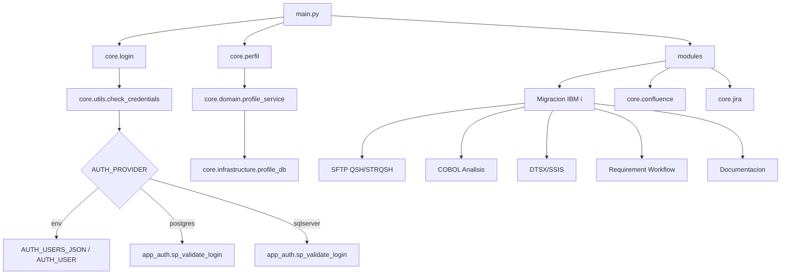

# Core: Arquitectura Actual

## Alcance

Este documento cubre componentes de primer nivel en `core/` y su relacion con `core/domain`, `core/infrastructure` y `core/ui`.

## Objetivo

La carpeta `core` concentra capacidades transversales para:

- autenticacion y autorizacion por modulos,
- integraciones empresariales (Confluence/Jira),
- utilidades de presentacion y logging,
- orquestacion del flujo principal de modernizacion IBM i.

## Flujo IBM i (Vista Core)

## Componentes Clave

### `login.py`

- Renderiza autenticacion en Streamlit.
- Valida usuario/clave contra `core.utils.check_credentials`.
- Controla ciclo de sesion (`logged_in`, `username`, `login_error`).

### `utils.py`

- Punto unico de autenticacion de app.
- Respeta `AUTH_PROVIDER` (`env`, `postgres`, `sqlserver`).
- En modo `env`, recarga credenciales desde variables para evitar valores stale por import.
- Expone utilidades comunes (`load_agent_prompt`, `step_header`).

### `perfil.py`

- Gestiona autorizacion por modulo y panel admin.
- Usa `ProfileService` + `profile_presenter` para desacoplar UI de reglas/estado.
- En `AUTH_PROVIDER=env`, opera con `USER_PROFILES_JSON` y `ADMINS_CSV`.
- En `AUTH_PROVIDER=postgres/sqlserver`, persiste cambios via stored procedures.

### `confluence.py` y `jira.py`

- Encapsulan integraciones HTTP empresariales.
- Implementan validaciones, manejo de errores y logging estandarizado.

### `logger.py`

- Configuracion central de logging.
- API comun para telemetria operativa de modulos.

## Variables de Entorno Relevantes

### Autenticacion y perfiles

- `AUTH_PROVIDER`
- `AUTH_USERS_JSON`
- `AUTH_USER`
- `AUTH_PASSWORD`
- `USER_PROFILES_JSON`
- `ADMINS_CSV`
- `DATABASE_URL` (postgres)
- `SQLSERVER_*` (sqlserver)

### Integraciones

- `JIRA_USER`, `JIRA_PASSWORD`
- variables de Confluence segun entorno

## Notas Operativas

- `AUTH_PROVIDER` es la unica llave para decidir proveedor de auth/perfiles.
- Si `AUTH_PROVIDER=env`, la fuente de autorizacion es exclusivamente `.env`.
- Para escenarios enterprise, se recomienda `AUTH_PROVIDER=postgres` o `sqlserver` con procedimientos `app_auth`.

## Resumen

`core` actua como columna vertebral de seguridad, permisos e integraciones. La UI (Streamlit) queda enfocada en experiencia de uso mientras dominio e infraestructura resuelven reglas, persistencia y conectividad externa.
