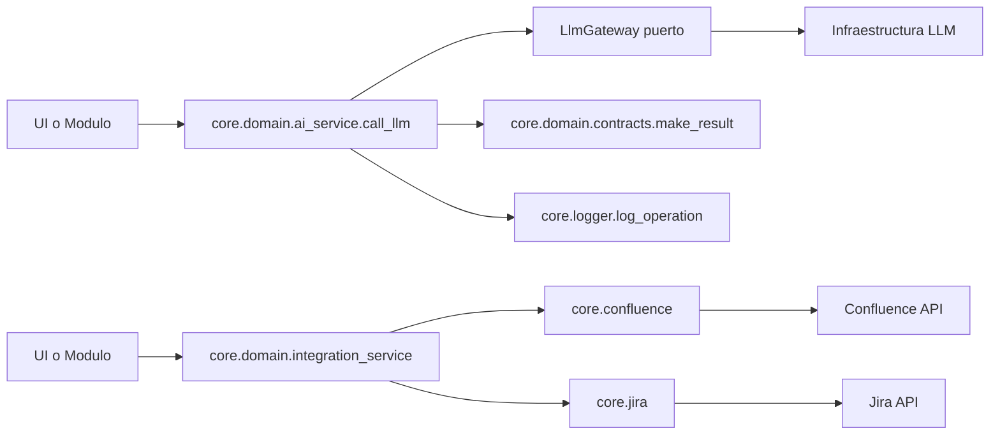

# Core Domain: Componentes de Primer Nivel

## Alcance
Este documento cubre exclusivamente los archivos de primer nivel en la carpeta core/domain, sin considerar subcarpetas como core/domain/ports.

## Objetivo de la capa domain
La carpeta core/domain contiene servicios de dominio y contratos ligeros que orquestan reglas de negocio sin depender de Streamlit. Esta capa encapsula decisiones de negocio (resultado estandar, invocacion de IA y publicacion de integraciones) y delega detalles tecnicos a capas externas.

## Diagrama de Interaccion (Nivel Domain)

## Componentes de core/domain (sin subcarpetas)

### 1) __init__.py
- Rol: inicializador del paquete de dominio.
- Estado actual: documenta que son servicios desacoplados de Streamlit.
- Utilidad: habilita imports de namespace y comunica intencion arquitectonica de la carpeta.

### 2) contracts.py
- Rol: contrato comun para respuestas de servicios de dominio.
- Funcion principal:
  - `make_result(success, message, data=None, error_code=None)`
- Responsabilidad:
  - unificar la estructura de salida de operaciones de dominio.
- Estructura estandar:
  - `success`: resultado booleano.
  - `message`: mensaje para consumo funcional/operativo.
  - `data`: payload opcional.
  - `error_code`: codigo opcional para control de errores.
- Valor tecnico:
  - reduce ambiguedad entre servicios.
  - simplifica manejo de errores aguas arriba.

### 3) ai_service.py
- Rol: servicio de dominio para ejecucion de llamadas LLM.
- Funcion principal:
  - `call_llm(system_role, user_content, model, temp, llm_gateway=None)`
- Responsabilidad:
  - validar presencia de gateway.
  - delegar generacion al puerto `LlmGateway`.
  - normalizar respuesta de error mediante `make_result`.
  - registrar trazabilidad con `log_operation`.
- Comportamiento clave:
  - si no existe `llm_gateway`, retorna fallo controlado (`missing_gateway`).
  - si el gateway responde error, propaga ese resultado.
  - si ocurre excepcion no controlada, retorna `unexpected_error`.
- Valor tecnico:
  - separa reglas de negocio de la implementacion concreta del proveedor LLM.
  - permite testear dominio con dobles/mocks de gateway.

### 4) integration_service.py
- Rol: fachada de dominio para integraciones externas.
- Funciones principales:
  - `publish_confluence_page(...)`
  - `resolve_confluence_metadata(page_url, user, api_token)`
  - `publish_jira_issue(...)`
- Responsabilidad:
  - exponer API de dominio simple para publicar artefactos en Confluence/Jira.
  - delegar en funciones de infraestructura ya existentes (`core.confluence`, `core.jira`).
- Valor tecnico:
  - centraliza llamadas de integracion para uso por modulos de negocio.
  - evita que los modulos dependan directamente de implementaciones HTTP concretas.

## Dependencias internas observadas

1. ai_service.py depende de:
- contracts.py (resultado estandar)
- core.domain.ports.llm_gateway (puerto)
- core.logger (observabilidad)

2. integration_service.py depende de:
- core.confluence (publicacion y metadata)
- core.jira (creacion de issues)

3. contracts.py:
- no depende de infraestructura, solo de typing

## Patrón arquitectonico aplicado

1. Ports and Adapters (Hexagonal):
- `ai_service.py` opera contra el puerto `LlmGateway`, no contra SDKs concretos.

2. Service Facade en dominio:
- `integration_service.py` simplifica interfaz para capas superiores.

3. Resultado canonico:
- `make_result` estandariza contratos de salida para flujos multiagente.

## Fortalezas actuales
- Acoplamiento bajo entre dominio e infraestructura LLM.
- Manejo de errores consistente y trazable.
- API de dominio simple para modulos de negocio.

## Riesgos y recomendaciones
1. Cohesion de integration_service:
- Actualmente actua como wrapper delgado.
- Recomendacion: incorporar validaciones de negocio de dominio cuando surjan reglas (por ejemplo, politicas de publicacion o enrichers de metadata).

2. Tipo de retorno:
- Se usan diccionarios flexibles para resultados.
- Recomendacion: evolucionar a TypedDict o dataclass para mayor seguridad tipada.

3. Cobertura de pruebas:
- Recomendacion: agregar pruebas unitarias para:
  - `call_llm` con gateway nulo,
  - `call_llm` con excepcion en gateway,
  - wrappers de `integration_service` con mocks de confluence/jira.

## Resumen
core/domain define la capa de negocio transversal: estandariza contratos de salida, abstrae la ejecucion LLM mediante puertos y ofrece una fachada limpia para integraciones empresariales. Esta estructura facilita testabilidad, reduce acoplamiento y mantiene los modulos funcionales enfocados en orquestacion de flujo, no en detalles tecnicos de infraestructura.
