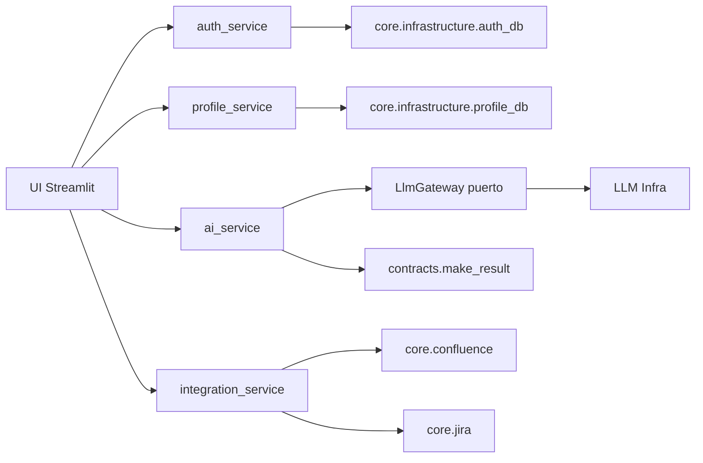

# Core Domain: Servicios de Negocio

## Alcance

Este README cubre archivos de primer nivel en `core/domain`.

## Objetivo

`core/domain` concentra reglas de negocio desacopladas de Streamlit y de SDKs concretos.

## Flujo Dominio (Auth, Perfiles, LLM, Integraciones)

## Componentes

### `contracts.py`

- Define el contrato estandar de respuesta (`make_result`).
- Homologa `success`, `message`, `data`, `error_code`.

### `ai_service.py`

- Orquesta llamadas LLM contra el puerto `LlmGateway`.
- No depende de proveedores concretos (OpenAI/Vertex).
- Registra telemetria de operacion con `core.logger`.

### `integration_service.py`

- Fachada de dominio para publicar contenido en Confluence/Jira.
- Centraliza llamadas a integraciones HTTP externas.

### `auth_service.py`

- Punto de negocio para autenticacion por `AUTH_PROVIDER`.
- Enruta a `env`, `postgres` o `sqlserver` mediante infraestructura.

### `profile_service.py`

- Servicio de autorizacion y administracion de perfiles.
- Carga perfiles/admins desde DB o variables de entorno.
- Gestiona crear usuario, actualizar perfil y reset de password.

## Principios Aplicados

- Ports and Adapters para IA.
- Service Layer para auth/perfiles.
- Contrato de respuesta uniforme para manejo de errores.

## Variables de Entorno Clave

- `AUTH_PROVIDER`
- `USER_PROFILES_JSON`
- `ADMINS_CSV`
- `DATABASE_URL`
- `SQLSERVER_*`
- `LLM_PROVIDER` y credenciales asociadas.

## Notas de Implementacion

- No existen perfiles hardcodeados en dominio: en modo `env`, la fuente es `.env`.
- `AUTH_PROVIDER` gobierna auth y perfiles persistentes.
- La UI consume estos servicios y evita logica de infraestructura directa.

## Resumen

La capa `core/domain` encapsula reglas funcionales y deja que infraestructura resuelva conectividad. Esto mejora testabilidad, trazabilidad y evolucion del sistema de modernizacion IBM i.
