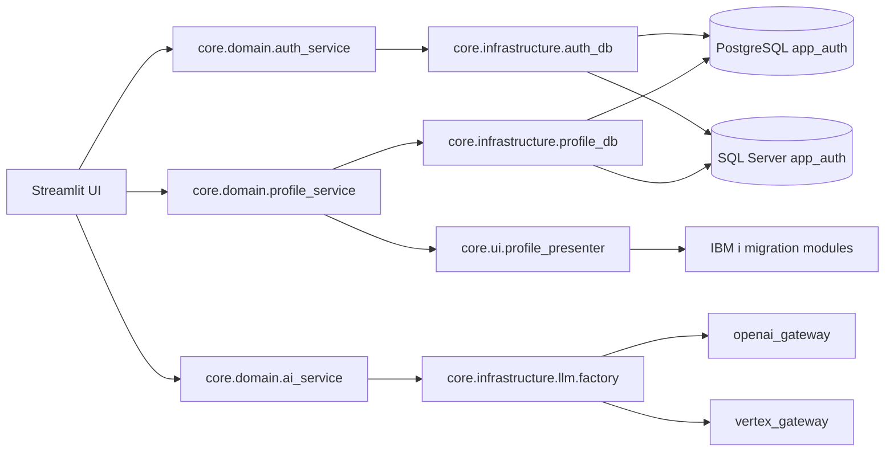

# Core Infrastructure: Adaptadores de Datos y Proveedores

## Alcance

Este README documenta la capa `core/infrastructure` y sus componentes de primer nivel.

## Objetivo

La capa de infraestructura aisla los detalles de conectividad externa y persistencia del codigo de dominio y UI. Provee adaptadores para:

- persistencia de autenticacion,
- persistencia de perfiles,
- acceso al repositorio de prompts,
- proveedores LLM.

## Contexto del Flujo de Migracion (IBM i)

## Componentes

### `auth_db.py`

- Provee helpers agnosticos de proveedor para persistencia de autenticacion.
- Resuelve `AUTH_PROVIDER`.
- Construye la cadena de conexion para SQL Server desde variables `SQLSERVER_*`.
- Valida credenciales contra:
  - `env` (`AUTH_USERS_JSON`, `AUTH_USER`, `AUTH_PASSWORD`),
  - PostgreSQL (`app_auth.sp_validate_login`),
  - SQL Server (`app_auth.sp_validate_login`).

### `profile_db.py`

- Encapsula operaciones de persistencia de perfiles.
- Soporta PostgreSQL y SQL Server para:
  - carga de modulos/admins por usuario,
  - carga de metadata de usuario,
  - actualizacion de perfil y modulos,
  - reseteo de contrasenas,
  - creacion de usuarios.

### `prompt_repository.py`

- Carga activos de prompts usados por modulos y flujos de IA.
- Mantiene la obtencion de prompts fuera de dominio/UI.

### `llm/`

- Contiene adaptadores de proveedores y fabrica de gateways:
  - `factory.py`
  - `openai_gateway.py`
  - `vertex_gateway.py`

## Variables de Entorno

### Persistencia de Auth y Perfiles

- `AUTH_PROVIDER`
- `DATABASE_URL`
- `SQLSERVER_DRIVER`
- `SQLSERVER_HOST`
- `SQLSERVER_PORT`
- `SQLSERVER_DATABASE`
- `SQLSERVER_USER`
- `SQLSERVER_PASSWORD`
- `SQLSERVER_TRUST_SERVER_CERTIFICATE`
- `AUTH_USERS_JSON`
- `AUTH_USER`
- `AUTH_PASSWORD`

### Proveedores LLM

- `LLM_PROVIDER`
- `OPENAI_API_KEY`
- `GOOGLE_CLOUD_PROJECT`
- `GOOGLE_CLOUD_LOCATION`
- `VERTEX_GEMINI_MODEL`
- `GEMINI_MODEL`

## Notas de Diseno

- Los servicios de dominio orquestan casos de uso; infraestructura ejecuta IO.
- `AUTH_PROVIDER` es el selector unico para el comportamiento de auth/perfiles.
- Infraestructura retorna resultados normalizados para mantener estables las capas consumidoras.

## Resumen

`core/infrastructure` es la frontera tecnica donde se implementan detalles de base de datos y proveedores, permitiendo que dominio y UI se enfoquen en los flujos de migracion IBM i y en el comportamiento funcional.
