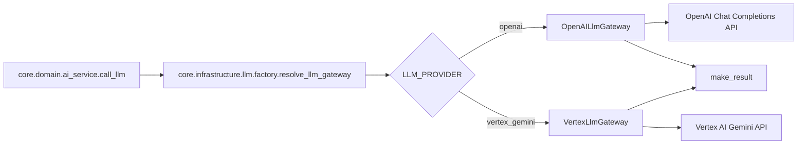

# Core Infrastructure LLM: Componentes de Primer Nivel

## Alcance
Este documento describe exclusivamente los archivos ubicados directamente en core/infrastructure/llm, sin considerar subcarpetas.

## Objetivo de la carpeta
La carpeta core/infrastructure/llm implementa la capa de infraestructura para proveedores de modelos de lenguaje. Su responsabilidad es conectar el dominio con SDKs externos (OpenAI y Vertex AI), devolviendo resultados normalizados para que las capas superiores no dependan de detalles del proveedor.

## Diagrama de Interaccion (Nivel LLM Infrastructure)

## Componentes de core/infrastructure/llm

### 1) __init__.py
- Rol: inicializador del paquete de infraestructura LLM.
- Estado actual: archivo vacio.
- Utilidad: habilita imports por namespace y compatibilidad de empaquetado.

### 2) factory.py
- Rol: selector/fabrica de gateway LLM segun configuracion.
- Funcion principal:
  - `resolve_llm_gateway(provider: str | None = None) -> tuple[LlmGateway | None, str]`
- Responsabilidades:
  - resolver proveedor desde parametro o variable de entorno `LLM_PROVIDER`.
  - mapear aliases de Vertex (`vertex_gemini`, `vertex`, `vertexai`, `gemini`).
  - retornar gateway concreto (`OpenAILlmGateway` o `VertexLlmGateway`).
  - cuando proveedor es desconocido, retornar `(None, selected)` para manejo aguas arriba.
- Valor tecnico:
  - centraliza decision de proveedor en un unico punto.
  - evita condicionamiento distribuido en multiples capas.

### 3) openai_gateway.py
- Rol: implementacion concreta del gateway para OpenAI.
- Clase principal:
  - `OpenAILlmGateway`
- Metodo principal:
  - `generate(system_role, user_content, model, temp) -> dict`
- Responsabilidades:
  - leer `OPENAI_API_KEY` desde entorno.
  - invocar `openai.OpenAI(...).chat.completions.create(...)`.
  - devolver contenido normalizado via `make_result`.
  - manejar errores especificos de SDK OpenAI:
    - `RateLimitError`
    - `APITimeoutError`
    - `APIConnectionError`
    - `OpenAIError`
    - excepcion generica fallback.
- Valor tecnico:
  - encapsula detalles de SDK y manejo de excepciones del proveedor.
  - mantiene contrato de salida estable para el dominio.

### 4) vertex_gateway.py
- Rol: implementacion concreta del gateway para Vertex AI Gemini.
- Clase principal:
  - `VertexLlmGateway`
- Metodo principal:
  - `generate(system_role, user_content, model, temp) -> dict`
- Responsabilidades:
  - resolver configuracion por entorno:
    - `GOOGLE_CLOUD_PROJECT`
    - `GOOGLE_CLOUD_LOCATION`
    - `VERTEX_GEMINI_MODEL` o `GEMINI_MODEL`
  - cargar dependencias de Vertex dinamicamente con `importlib`.
  - inicializar cliente Vertex y generar contenido.
  - normalizar salida y errores con `make_result`.
  - validar caso de respuesta vacia (`empty_response`).
- Valor tecnico:
  - desacopla el proyecto de dependencia dura en import-time de Vertex.
  - permite fallback claro cuando falta configuracion/dependencia.

## Contrato comun de salida
Ambos gateways retornan diccionarios con el formato de dominio (via `make_result`):
- `success`: bool
- `message`: str
- `data`: dict opcional (incluye `content` cuando hay exito)
- `error_code`: str opcional

Esto habilita que la capa domain trate OpenAI y Vertex de forma uniforme.

## Variables de entorno relevantes

- Seleccion de proveedor:
  - `LLM_PROVIDER`

- OpenAI:
  - `OPENAI_API_KEY`

- Vertex AI:
  - `GOOGLE_CLOUD_PROJECT`
  - `GOOGLE_CLOUD_LOCATION`
  - `VERTEX_GEMINI_MODEL`
  - `GEMINI_MODEL`

## Patrones de diseno observados

1. Factory Method:
- `factory.py` decide implementacion concreta segun configuracion.

2. Adapter / Gateway:
- cada proveedor expone el mismo metodo `generate(...)` orientado al puerto de dominio.

3. Error Normalization:
- todos los errores se convierten a `make_result(...)` con codigos funcionales.

## Fortalezas actuales
- Bajo acoplamiento entre dominio y proveedor LLM.
- Soporte multi-proveedor con interfaz comun.
- Manejo de errores explicito y consistente.

## Riesgos y recomendaciones
1. Observabilidad:
- actualmente el logging de operacion principal ocurre en domain.
- recomendacion: agregar metricas de latencia por proveedor y modelo para tuning operativo.

2. Robustez de contenido:
- recomendacion: validar que `response.choices` exista y contenga mensaje en OpenAI para evitar edge cases de respuestas incompletas.

3. Configuracion por entorno:
- recomendacion: agregar validador de startup que alerte faltantes criticos antes de primera invocacion.

4. Evolucion de contratos:
- recomendacion: tipar `data` con TypedDict para garantizar presencia/forma de `content`.

## Resumen
core/infrastructure/llm materializa la integracion con proveedores LLM sin contaminar la logica de negocio. La fabrica selecciona el gateway correcto y cada adapter encapsula SDK, configuracion y errores. Esto permite evolucionar proveedores y modelos manteniendo estable el contrato que consume la capa de dominio.
