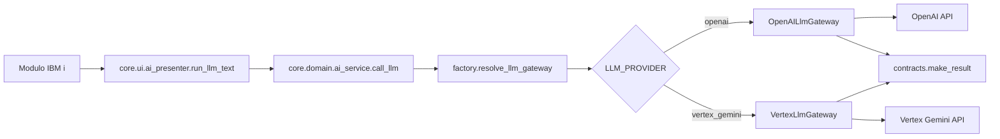

# Core Infrastructure LLM: Integracion de Proveedores

## Alcance

Este documento cubre archivos de primer nivel en `core/infrastructure/llm`.

## Objetivo

Implementar adapters para proveedores LLM y exponer una API uniforme al dominio.

## Flujo de IA en Modernizacion IBM i

## Componentes

### `factory.py`

- Resuelve gateway segun `LLM_PROVIDER`.
- Soporta aliases comunes (`vertex`, `vertexai`, `gemini`).
- Retorna `(gateway, provider_selected)` para manejo explicito aguas arriba.

### `openai_gateway.py`

- Adapter para OpenAI Chat Completions.
- Normaliza respuesta y errores a `make_result`.

### `vertex_gateway.py`

- Adapter para Vertex AI Gemini.
- Resuelve configuracion por entorno y dependencias dinamicas.
- Normaliza respuesta y errores a `make_result`.

### `__init__.py`

- Inicializador de paquete.

## Contrato de Salida

Todos los gateways devuelven:

- `success`
- `message`
- `data` (incluye `content` en exito)
- `error_code`

Esto mantiene estable el dominio aunque cambie el proveedor.

## Variables de Entorno

- `LLM_PROVIDER`
- `OPENAI_API_KEY`
- `GOOGLE_CLOUD_PROJECT`
- `GOOGLE_CLOUD_LOCATION`
- `VERTEX_GEMINI_MODEL`
- `GEMINI_MODEL`

## Buenas Practicas Operativas

- Definir `LLM_PROVIDER` explicitamente en `.env`.
- Versionar cambios de modelo por ambiente (dev/qa/prod).
- Registrar latencia, `error_code` y volumen de tokens en observabilidad externa.

## Resumen

`core/infrastructure/llm` desacopla la logica de negocio de SDKs externos y habilita una integracion IA consistente para los flujos de modernizacion IBM i.
