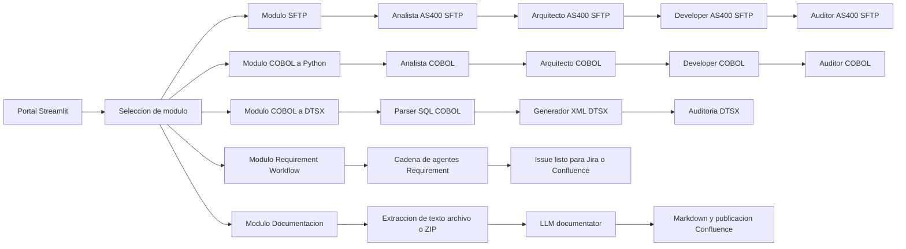

# Modelo de Componentes del Proyecto

## Proposito
Este documento describe, en detalle tecnico, que hace cada componente del ecosistema funcional del proyecto. Aunque este README vive en la ruta /modelo, su alcance principal es la carpeta modules, que contiene los modulos de negocio visibles en la interfaz Streamlit.

## Vision General
La aplicacion implementa un hub de agentes para modernizacion de sistemas legacy IBM i y COBOL. Cada modulo sigue un flujo guiado por pasos, apoyado en:

- Estado por modulo en st.session_state.
- Prompts de agentes especializados en .github/agents.
- Invocacion de LLM por medio de core.ui.ai_presenter.run_llm_text.
- Utilidades comunes de UI y carga de prompts desde core.utils.

## Diagrama de Flujo (IBM i Legacy Migrator)

## Componentes dentro de modules

### 1) __init__.py
- Rol: marca la carpeta modules como paquete Python.
- Responsabilidad: habilitar imports internos y externos de los modulos funcionales.

### 2) modulo_sftp.py
- Rol: flujo guiado para migrar FTP inseguro a SFTP en fuentes IBM i.
- Entrada: archivos RPGLE, CLP y SQLRPGLE.
- Flujo principal:
  1. Carga de fuente.
  2. Analisis de comandos FTP y dependencias.
  3. Propuesta de arquitectura SFTP.
  4. Generacion de codigo modernizado.
  5. Auditoria de seguridad.
  6. Descarga de resultado.
- Integraciones:
  - Prompt analyst: 01_analyst_AS400SFTP.md
  - Prompt architect: 02_architect_AS400SFTP.md
  - Prompt developer: 03_developer_AS400SFTP.md
  - Prompt auditor: 04_auditor_AS400SFTP.md

### 3) modulo_cobol.py
- Rol: migracion guiada de COBOL a Python.
- Entrada: archivos .cbl, .cob y .txt.
- Flujo principal:
  1. Carga de codigo COBOL.
  2. Analisis de logica y dependencias.
  3. Plan de arquitectura editable.
  4. Generacion de codigo Python.
  5. Auditoria final y descarga.
- Caracteristica clave: el plan arquitectonico es editable antes de generar el codigo.

### 4) modulo_dtsx.py
- Rol: orquestador UI para construir paquetes SSIS (.dtsx) desde COBOL con SQL embebido.
- Entrada: fuente COBOL con bloques EXEC SQL.
- Flujo principal:
  1. Carga y deteccion preliminar de conexiones SQL.
  2. Analisis funcional y tecnico.
  3. Diseno de paquete SSIS (editable).
  4. Generacion de blueprint y XML DTSX.
  5. Auditoria y descarga del paquete.
- Dependencia clave: usa funciones de dtsx_generator.py para parsing y construccion XML.

### 5) dtsx_generator.py
- Rol: motor tecnico para transformar señales COBOL en un paquete DTSX valido.
- Capacidades principales:
  - Extrae sentencias SQL desde bloques EXEC SQL.
  - Detecta conexiones y tipo de base de datos (SQL Server o Sybase).
  - Genera connection managers y variables SSIS.
  - Construye estructura XML DTS con GUID estables.
  - Aplica deduplicacion y asignacion de roles source/destination.
- Resultado: texto XML listo para descarga como .dtsx.

### 6) modulo_Requirement_WorkFlow.py
- Rol: pipeline de refinamiento de requerimientos hasta un issue ejecutable.
- Entrada:
  - requerimiento libre en texto,
  - documentos de contexto,
  - metadatos opcionales de Confluence.
- Flujo principal (agentes):
  1. Creator de historia de usuario.
  2. Refiner funcional.
  3. Diagramacion (Mermaid por historia).
  4. Sizing.
  5. Casos de prueba.
  6. Formateo final para issue Jira/GitHub.
- Extras:
  - render Mermaid en Streamlit,
  - exportacion a PDF,
  - publicacion de issue en Jira.

### 7) modulo_documentation.py
- Rol: generador de documentacion tecnica automatica para archivo individual o ZIP.
- Entrada:
  - seleccion de tecnologias,
  - archivo de codigo o paquete ZIP.
- Flujo principal:
  1. Seleccion de tecnologias por categorias colapsables.
  2. Carga de archivo con tipos dinamicos segun tecnologia elegida.
  3. Extraccion de texto y generacion de documentacion via LLM.
  4. Descarga Markdown y publicacion en Confluence.
- Mejoras de calidad incorporadas:
  - limites de tamano de carga,
  - deteccion de encoding y reportes de reemplazo,
  - logging de operaciones criticas,
  - validaciones de flujo por paso,
  - limpieza diferida y segura de credenciales en session_state.

## Componentes transversales que usa modules

- core.ui.ai_presenter.run_llm_text:
  - capa de ejecucion LLM para todos los modulos.
- core.utils.load_agent_prompt:
  - carga de prompts por nombre de archivo.
- core.utils.step_header:
  - estandar visual para los pasos del flujo.
- core.domain.integration_service:
  - integraciones de salida (Confluence y Jira).
- core.logger:
  - logging estructurado con eventos de exito y error.

## Patrones de diseno observados

1. Wizard por pasos:
- Cada modulo avanza por un current_step y bloquea pasos posteriores si faltan prerequisitos.

2. Estado namespaced por modulo:
- Prefijos como sftp_, cobol_, dtsx_, doc_ y req_ evitan colisiones de estado.

3. Human-in-the-loop:
- Se permite editar salidas intermedias (por ejemplo, plan de arquitectura) antes de generar artefactos finales.

4. Cadena de agentes especializada:
- Analista -> Arquitecto -> Developer -> Auditor para reducir riesgo tecnico en migraciones legacy.

## Recomendaciones de operacion

- Mantener los prompts por dominio versionados en .github/agents.
- Agregar pruebas de regresion para cada modulo al modificar reglas de negocio.
- Mantener alineadas las extensiones soportadas entre uploader y parser ZIP.
- Restringir credenciales sensibles en session_state y limpiar despues de cada publicacion.

## Resumen ejecutivo
La carpeta modules implementa la capa de orquestacion funcional del producto: recibe entradas de usuario, coordina agentes LLM por etapa, valida flujo por pasos y entrega artefactos de modernizacion (codigo, DTSX, documentacion e issues). Este diseno permite migrar sistemas IBM i/COBOL de forma guiada, auditable y con salida util para equipos de arquitectura, desarrollo y gobierno tecnico.
