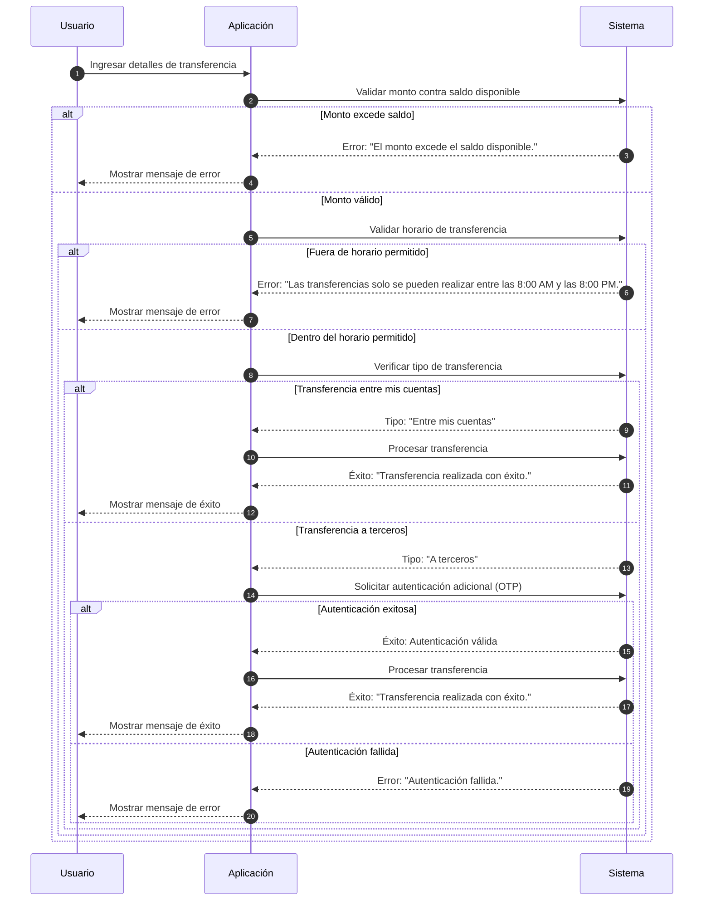

# [US-002] Validación de Transferencias Bancarias
**SP:** 8 | **Prioridad:** Alta

## 📝 Descripción
Como usuario de la aplicación bancaria, quiero que se realicen validaciones al intentar hacer una transferencia, para asegurarme de que cumplo con los requisitos de monto, horario y tipo de transferencia antes de proceder.

## ✅ Criterios de Aceptación
- [ ] El sistema debe mostrar un mensaje de error si el monto ingresado excede el saldo disponible.
- [ ] El sistema debe mostrar un mensaje de error si la transferencia se intenta fuera del horario permitido (8:00 AM a 8:00 PM).
- [ ] El sistema debe identificar y procesar sin restricciones adicionales las transferencias entre cuentas del mismo usuario.
- [ ] El sistema debe requerir autenticación adicional para transferencias a terceros y mostrar un mensaje de error si la autenticación falla.
- [ ] El sistema debe mostrar un mensaje de éxito cuando la transferencia se realiza correctamente.

## ⚙️ Especificaciones Técnicas

### Stack Sugerido
- **Backend:** Node.js/Java para implementar validaciones y manejar flujos de autenticación.
- **Frontend:** React para manejar la interfaz de usuario y mostrar mensajes de error.
- **Integración:** Sistema de autenticación externo para transferencias a terceros.

### Bloqueantes y Riesgos
- Integración pendiente con el sistema de autenticación para validar transferencias a terceros.
- Definición de mensajes de error específicos para cada validación fallida.
- Posible sobrecarga del sistema de autenticación debido a múltiples intentos fallidos.
- Riesgo de confusión del usuario si los mensajes de error no son claros o específicos.

## 🧪 Estrategia de QA
### Resumen de Casos de Prueba
- **TC-01:** Validación de monto superior al saldo disponible.
- **TC-02:** Validación de horario fuera del permitido.
- **TC-03:** Transferencia entre cuentas propias.
- **TC-04:** Transferencia a terceros con autenticación exitosa.
- **TC-05:** Transferencia a terceros con autenticación fallida.
- **TC-06:** Transferencia exitosa.

### Cobertura de Escenarios
- **Happy Path:** TC-06 cubre el flujo ideal donde el usuario realiza una transferencia con todos los detalles correctos.
- **Negative Testing:** TC-01, TC-02, y TC-05 cubren escenarios donde el usuario comete errores o no cumple con las condiciones necesarias.
- **Edge Cases:** Considerar pruebas adicionales para transferencias justo a las 8:00 PM, y verificar el comportamiento del sistema en caso de pérdida de conexión durante la autenticación.

### Pruebas No Funcionales
- **Seguridad:** Validar que los inputs sean seguros contra SQL Injection y XSS.
- **Performance:** Verificar el comportamiento del sistema bajo carga ligera, especialmente durante el proceso de autenticación.
- **Accesibilidad:** Asegurar que los mensajes de error sean accesibles y comprensibles para todos los usuarios.